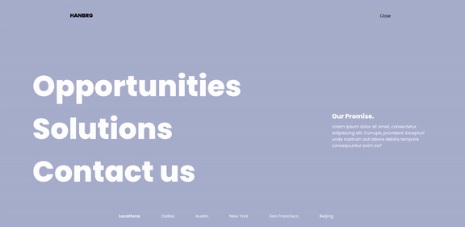
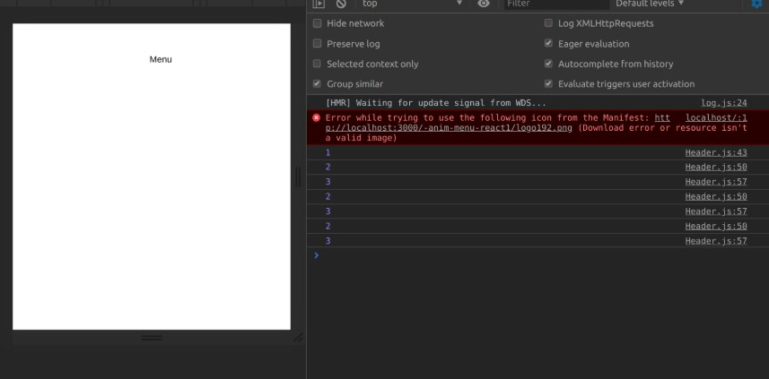

## ANIMATED Menu in react using react-router-dom and GSAP.

tutorial by Wrong Akram 

 
 

When you look at the first image, the console.log(1) represents the state of the page on initial,
then when you click(check img 2) , it becomes 2 which represents the opened state on console.log(2), then you click again
and it becomes console.log(3) because you are now in state 3 

 
 

 

 
 
