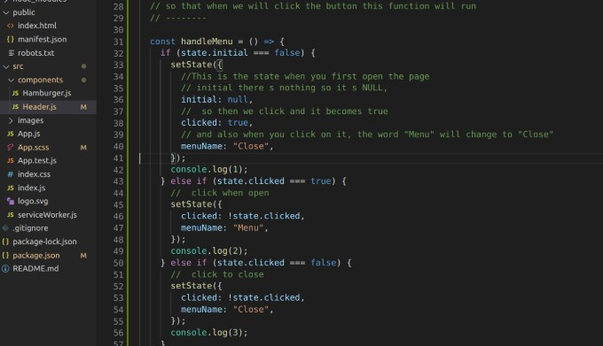

## ANIMATED Menu in react using react-router-dom and GSAP.

### App (in Progress)

 
 

When you look at the first image, the console.log(1) , represents the state of the page on initial,
then when you click(check img 2) , it becomes 2 which represents the opened state, then you click again
and it becomes 3 (because you are now in state 3) which is console.log(3) 

 
 

 

<!--  -->

 
 
